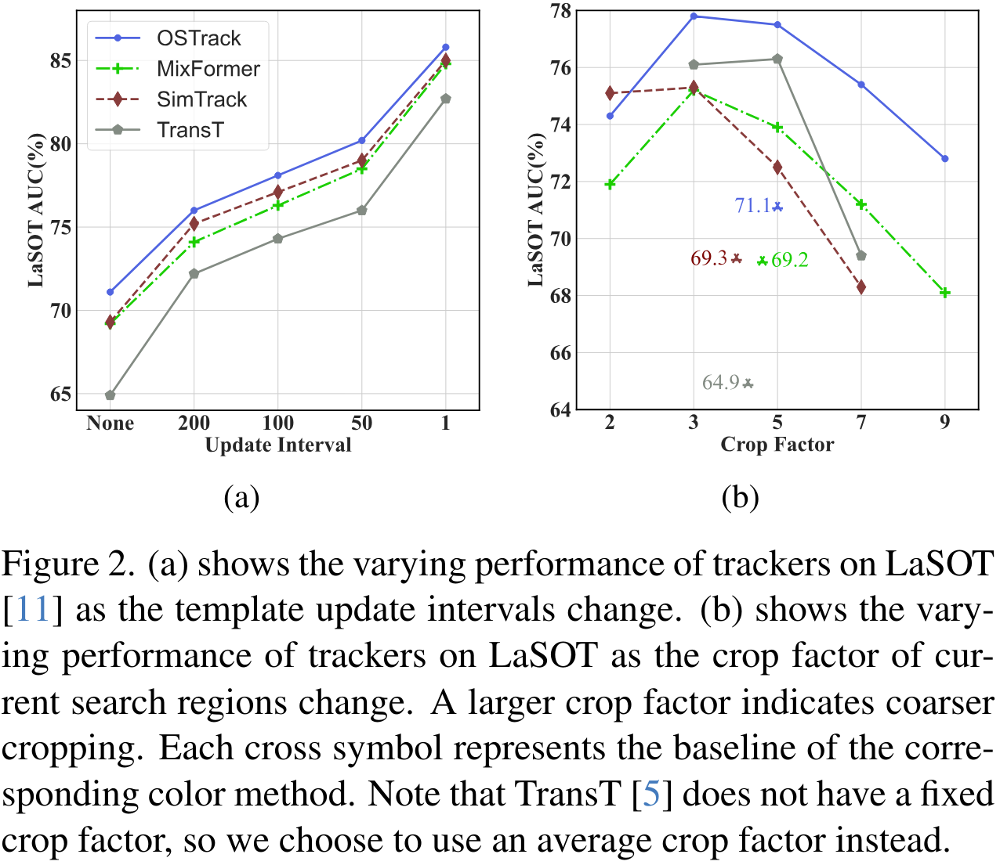
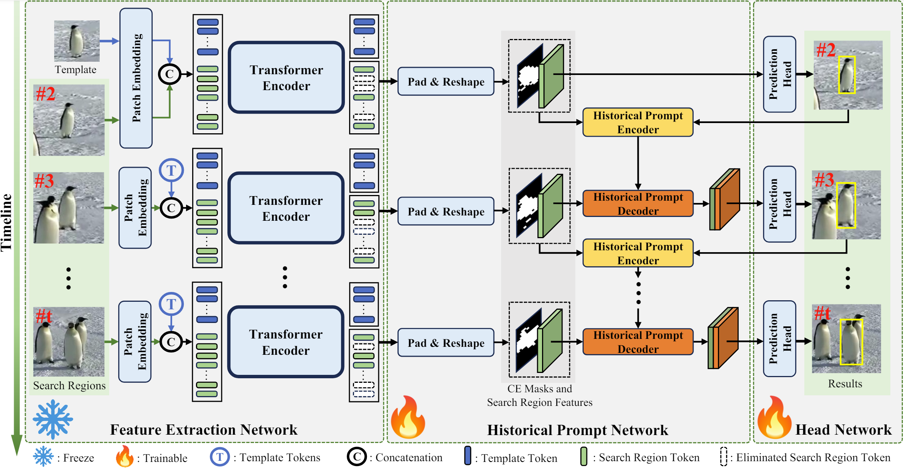

# [CVPR'24] HIPTrack: Visual Tracking with Historical Prompts

Official implementation of [HIPTrack: Visual Tracking with Historical Prompts](https://arxiv.org/abs/2311.02072). (CVPR 2024)


[](https://paperswithcode.com/sota/visual-object-tracking-on-lasot?p=learning-historical-status-prompt-for)
[](https://paperswithcode.com/sota/visual-object-tracking-on-got-10k?p=learning-historical-status-prompt-for)
[](https://paperswithcode.com/sota/visual-object-tracking-on-trackingnet?p=learning-historical-status-prompt-for)
[](https://paperswithcode.com/sota/visual-object-tracking-on-lasot-ext?p=learning-historical-status-prompt-for)
[](https://paperswithcode.com/sota/visual-object-tracking-on-uav123?p=learning-historical-status-prompt-for)
[](https://paperswithcode.com/sota/visual-object-tracking-on-otb-2015?p=learning-historical-status-prompt-for)
[](https://paperswithcode.com/sota/visual-object-tracking-on-needforspeed?p=learning-historical-status-prompt-for)

## Highlights

#### 🌟Introduction

Trackers that follow Siamese paradigm utilize similarity matching between template and search region features for tracking. Many methods have been explored to enhance tracking performance by incorporating tracking history to better handle scenarios involving target appearance variations such as deformation and occlusion. However, the utilization of historical information in existing methods is insufficient and incomprehensive, which typically requires repetitive training and introduces a large amount of computation. In this paper, we show that by providing a tracker that follows Siamese paradigm with precise and updated historical information, a significant performance improvement can be achieved with completely unchanged parameters. 
<div align='center'>

</div>
Based on this, we propose a historical prompt network that uses refined historical foreground masks and historical visual features of the target to provide comprehensive and precise prompts for the tracker. We build a novel tracker called HIPTrack based on the historical prompt network, which achieves considerable performance improvements without the need to retrain the entire model. 




#### 🌟Strong performance

You can download the model weights and raw_result from [Google Drive](https://drive.google.com/drive/folders/1W-fJCnfxwz2IIC6O8R9ADOAK_ebkmC-d?usp=sharing).

| Tracker      | LaSOT (AUC / Norm P / P) | LaSOT extension (AUC / Norm P / P) | TrackingNet (AUC / Norm P / P) | GOT-10k (AO / SR 0.5 / SR 0.75) |
| ------------ | ------------------------ | ---------------------------------- | ------------------------------ | ------------------------------- |
| **HIPTrack** | **72.7 / 82.9 / 79.5**   | **53.0 / 64.3 / 60.6**             | **84.5 / 89.1 / 83.8**         | **77.4 / 88.0 / 74.5**          |


#### 🌟Inference Speed

Our model (backbone: ViT-B, resolution: 384x384) can run at **45 fps** (frames per second) on a single NVIDIA Tesla V100 GPU.

|              | Trainable Parameters (M) | Parameters (M) | MACs (G) | Speed (FPS) |
| ------------ | ------------------------ | -------------- | -------- | ----------- |
| **HIPTrack** | 34.1                     | 120.4          | 66.9     | 45.3        |


## Quick Start

### Data Preparation

Put the tracking datasets in `./data`. It should look like this:

```tex
${PROJECT_ROOT}
 -- data
     -- lasot
         |-- airplane
         |-- basketball
         |-- bear
         ...
     -- got10k
         |-- test
         |-- train
         |-- val
     -- coco
         |-- annotations
         |-- images
     -- trackingnet
         |-- TRAIN_0
         |-- TRAIN_1
         ...
         |-- TRAIN_11
         |-- TEST
```


### Install the environment

Our implementation is based on PyTorch 1.10.1+CUDA11.3. Use the following command to install the runtime environment:

```bash
conda env create -f HIPTrack_env_cuda113.yaml
```


### Set project paths

Run the following command to set paths for this project

```bash
python3 tracking/create_default_local_file.py --workspace_dir . --data_dir ./data --save_dir ./output
```

After running this command, you can also modify paths by editing these two files

```bash
lib/train/admin/local.py  # paths about training
lib/test/evaluation/local.py  # paths about testing
```


### Training

- For training on datasets except GOT-10k.

  Download pre-trained [DropTrack weights](https://drive.google.com/file/d/1l0YSK0QLPGVIGiNXwlaWp5uhIkJawJqh/view?usp=sharing) and put it under `$PROJECT_ROOT$/pretrained_models`.

  ```bash
  python3 tracking/train.py --script hiptrack --config hiptrack --save_dir ./output --mode multiple --nproc_per_node 4
  ```

- For training on GOT-10k.

  Download pre-trained [DropTrack weights](https://drive.google.com/file/d/1OMYfyvkpxf7DVS7wYLUGmXPydS9TkskT/view?usp=sharing) and put it under `$PROJECT_ROOT$/pretrained_models`.

  ```bash
  python3 tracking/train.py --script hiptrack --config hiptrack_got --save_dir ./output --mode multiple --nproc_per_node 4
  ```


### Evaluation

Change the dataset path in `lib/test/evaluation/local.py` to your storage path.

- LaSOT or other off-line evaluated benchmarks (modify `--dataset` correspondingly)

```bash
python3 tracking/test.py hiptrack hiptrack --dataset lasot --threads 16 --num_gpus 4
python3 tracking/analysis_results.py # need to modify tracker configs and names
```

- GOT10K-test

```bash
python3 tracking/test.py hiptrack hiptrack_got --dataset got10k_test --threads 16 --num_gpus 4
python3 lib/test/utils/transform_got10k.py --tracker_name hiptrack --cfg_name hiptrack_got
```

- TrackingNet

```bash
python3 tracking/test.py hiptrack hiptrack --dataset trackingnet --threads 16 --num_gpus 4
python3 lib/test/utils/transform_trackingnet.py --tracker_name hiptrack --cfg_name hiptrack
```


### Compute FLOPs/Params

```bash
bash tracking/profile_hiptrack.sh
```


## Citing HIPTrack

```
@inproceedings{cai2024hiptrack,
  title={HIPTrack: Visual Tracking with Historical Prompts},
  author={Cai, Wenrui and Liu, Qingjie and Wang, Yunhong},
  booktitle={Proceedings of the IEEE/CVF Conference on Computer Vision and Pattern Recognition},
  year={2024}
}
```


## Acknowledgement

Thanks to the following repo for providing us with a lot of convenience to implement our method.

- [PyTracking](https://github.com/visionml/pytracking.git)
- [OSTrack](https://github.com/botaoye/OSTrack.git)
- [STMTrack](https://github.com/fzh0917/STMTrack.git)
- [STCN](https://github.com/hkchengrex/STCN.git)
- [STM](https://github.com/seoungwugoh/STM)

We also thank to the following repositories for facilitating the analysis in Figure 2 of our paper.

- [MixFormer](https://github.com/MCG-NJU/MixFormer.git)
- [SimTrack](https://github.com/LPXTT/SimTrack.git)
- [TransT](https://github.com/chenxin-dlut/TransT.git)


## Contact

If you have any questions, just create issues or email me. 😀
